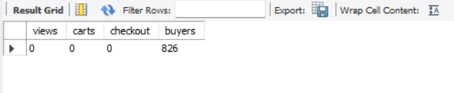
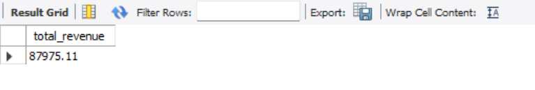
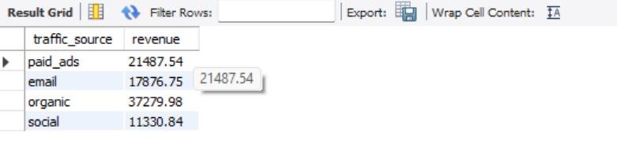

# 📊 E-commerce User Behavior Analysis (SQL Project)

## 📌 Project Overview
This project analyzes user behavior in an e-commerce platform using SQL.  
The dataset contains user interactions such as page views, cart additions, and purchases.

---

## 🎯 Objectives
- Analyze user activity  
- Track conversion funnel  
- Calculate revenue  
- Identify top products  
- Compare traffic sources  

---

## 🧱 Database Schema
Table: `user_events`

| Column Name     | Description |
|----------------|------------|
| event_id       | Unique event ID |
| user_id        | User identifier |
| event_type     | Type of event |
| event_date     | Timestamp |
| product_id     | Product ID |
| amount         | Purchase value |
| traffic_source | Source of traffic |

---

## 📊 Key SQL Analysis

### 🔹 Funnel Analysis
Tracks user journey from viewing → cart → purchase.

### 🔹 Revenue Analysis
Calculates total revenue and source-wise revenue.

### 🔹 Product Analysis
Identifies top-selling products.

---

## 📸 Project Output

### 🔹 Funnel Analysis

📌 Shows user drop-off from page view → add to cart → purchase.

---

### 🔹 Revenue Analysis

📌 Displays total revenue generated from purchases.

---

### 🔹 Top Products

📌 Highlights the most frequently purchased products.

---

## 🛠️ Tools Used
- MySQL  
- SQL Queries  

---

## 🚀 How to Run
1. Run `schema.sql`  
2. Import `user_events.csv`  
3. Execute `queries.sql`  

---

## 💡 Key Insights
- Identified significant drop-offs in the conversion funnel  
- Found top-performing products based on purchase frequency  
- Analyzed revenue contribution from user transactions  
- Observed user behavior patterns across different stages  

---

## 👨‍💻 Author
**Rohit Sharma**
